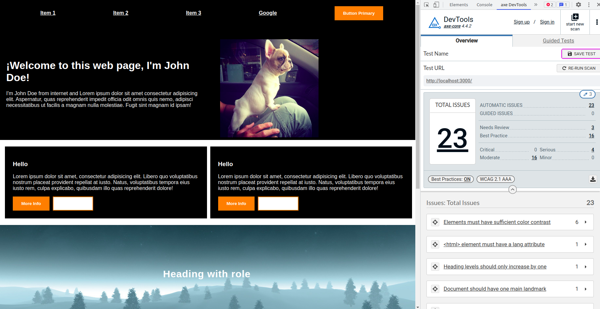

# Getting Started with this training

To understand accessibility from the developer side, we create this example to fix issues and understand the severity of each issues.

Technologies:

- create-react-app
- typescript
- styled-components
- storybook

## How to install

```
npm run install
```

## How to run the application

```
npm run start
```

## How to run storybook

```
npm run storybook
```

## Overview


